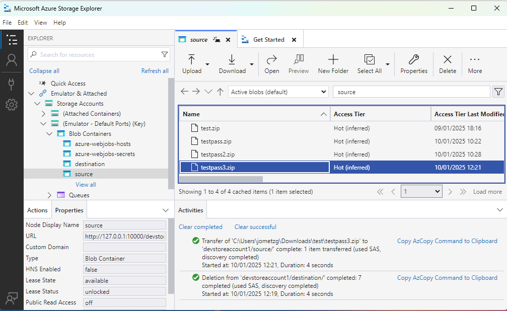
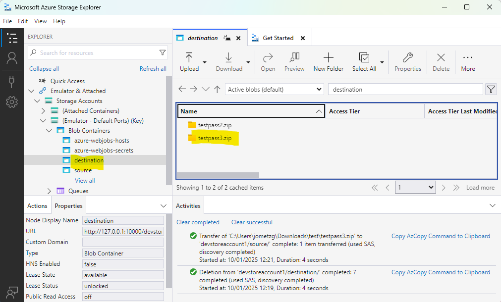
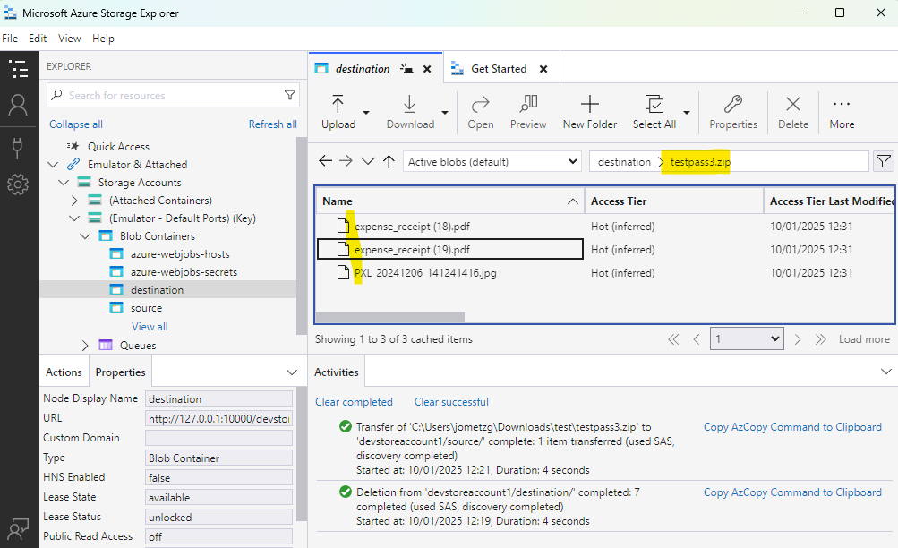
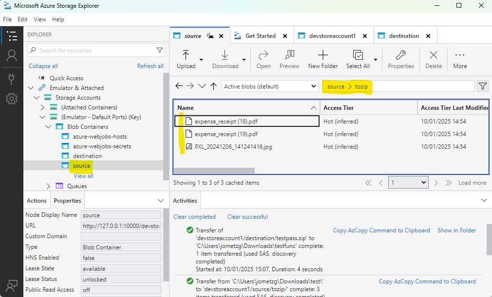
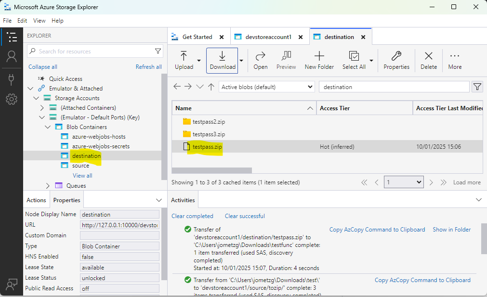
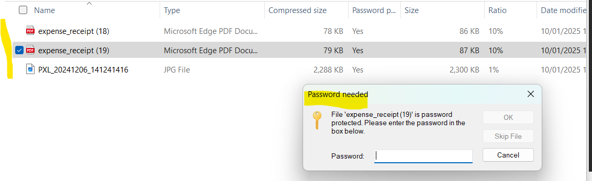

# Encrypted 7Zip file extraction to blob storage
This repo is an Azure Function that can extract encrypted 7Zip files to Azure Storage Blobs.

It can also encrypt an blob folder, encrypt it and put the zip in another blob container.


## Decrypt a 7zip file
This uses [SevenZipExtractor](https://github.com/adoconnection/SevenZipExtractor) to perform the extraction process.

The Function has an HTTP trigger and can be tested with an HTTP request:

```
### Send a request to unzip the following password protected file
### using SevenZipExtractor library https://github.com/adoconnection/SevenZipExtractor
POST http://localhost:7144/api/Extract7Zip
Content-Type: application/json

{
    "SourceContainerName": "source",
    "ZipBlobName": "testpass3.zip",
    "Password": "testpassword",  
    "DestinationContainerName": "destination"
}
```

For the above to work, in development mode, create 2 containers in Emulated storage:
1. source - where you can upload an encrypted zip - it is suggested to use 7zip for this
2. destination - where the extracted files will be created. Note that these will be in a folder of the same name as the zip file.

This may be tested with [Azure Storage Explorer](https://azure.microsoft.com/en-us/products/storage/storage-explorer)

### Source zip file


### Destination folder


### Destination files


## Encrypt a Folder
This uses a different libary (as SevenZipExtractor appears to only support extraction. It uses [SharpZipLib](https://github.com/icsharpcode/SharpZipLib)

This again has an HTTP trigger for ease of testing.

```
### Send a request to zip a blob folder with password protection
### using SharpZipLib library https://github.com/icsharpcode/SharpZipLib
POST http://localhost:7144/api/CreateZip
Content-Type: application/json

{
    "SourceContainerName": "source",
    "SourceFolderName": "tozip/",
    "ZipBlobName": "testpass.zip",
    "Password": "testpassword",  
    "DestinationContainerName": "destination"
}
```

### Source folder


### Destination zip


### Destination files



